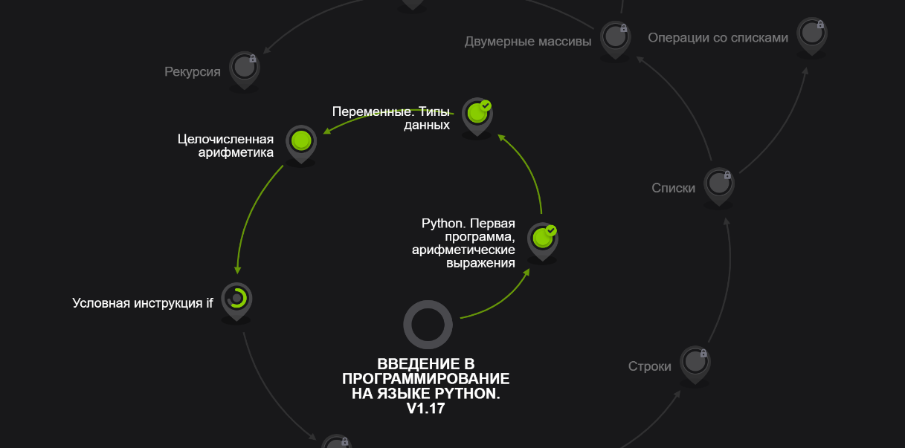
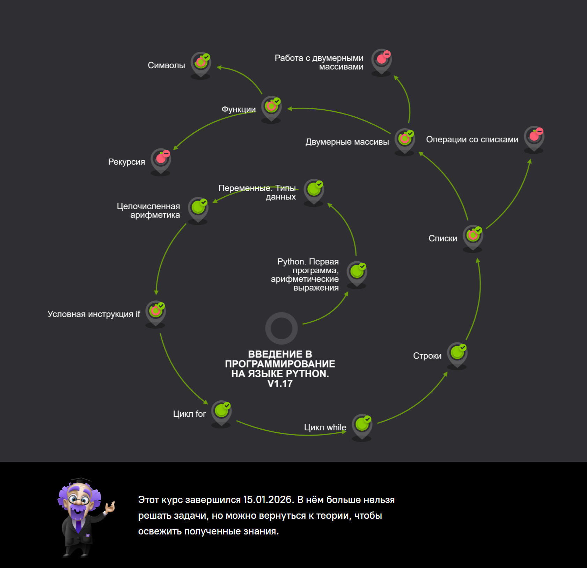

# project
Varya Semenova
11.12

12.01-18.01
from flask import Flask
app = Flask(__name__)
chords = {
    "Am": "E|---0---|\nB|---1---| (Указательный)\nG|---2---| (Безымянный)\nD|---2---| (Средний)\nA|---0---|\nE|---X---|",
    "C": "E|---0---|\nB|---1---| (Указтельный) \nG|---0---|\nD|---2---| (Средний)\nA|---3---| (Безымянный)\nE|---X---|",
    "G": "E|---3---| (Мизинец)\nB|---0---|\nG|---0---|\nD|---0---|\nA|---2---| (Средний)\nE|---3---| (Безымянный)"
}
@app.route('/')
def home():
    html = "<h1>Выбор аккордов:</h1>"
    for name in chords.keys():
        html += f'
<a href="/chord/{name}">{name}</a>
'
    return html

@app.route('/chord/<name>')
def show_chord(name):
    info = chords.get(name, "Аккорд не найден")
    return f"""
        <h1>Аккорд {name}</h1>
        <pre style='font-size: 20px;'>{info}</pre>
         
        <a href='/'>Назад к списку</a>
    """

if __name__ == '__main__':
    app.run(debug=True)
   