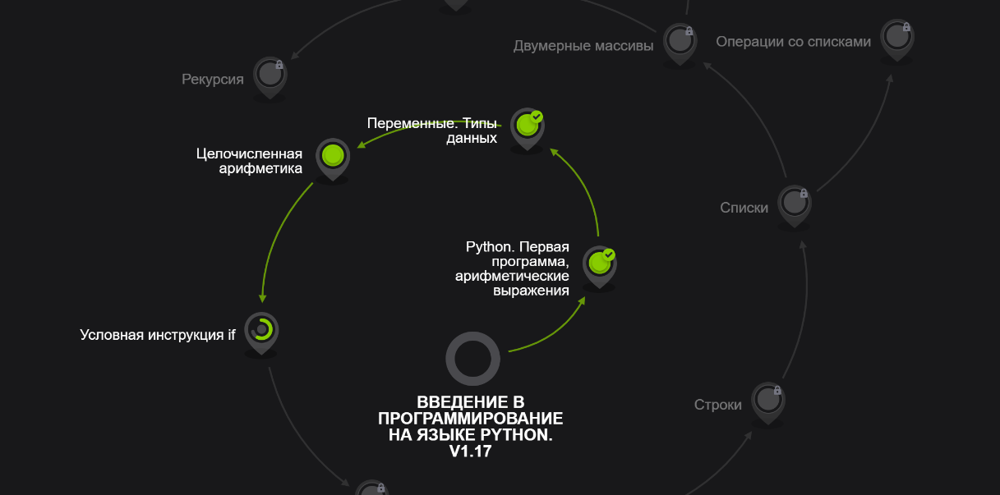
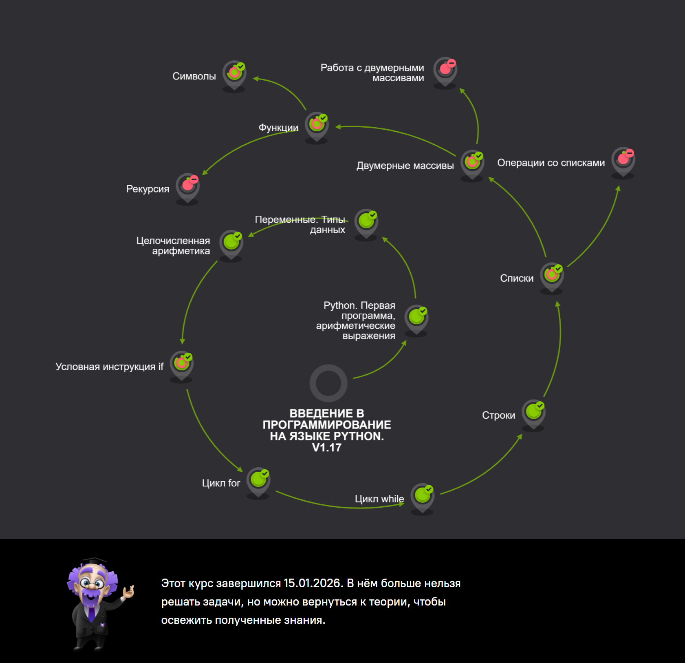

# project
Varya Semenova
11.12

12.01-18.01
from flask import Flask
app = Flask(__name__)
chords = {
    "Am": "E|---0---|\nB|---1---| (Указательный)\nG|---2---| (Безымянный)\nD|---2---| (Средний)\nA|---0---|\nE|---X---|",
    "C": "E|---0---|\nB|---1---| (Указтельный) \nG|---0---|\nD|---2---| (Средний)\nA|---3---| (Безымянный)\nE|---X---|",
    "G": "E|---3---| (Мизинец)\nB|---0---|\nG|---0---|\nD|---0---|\nA|---2---| (Средний)\nE|---3---| (Безымянный)"
}
@app.route('/')
def home():
    html = "<h1>Выбор аккордов:</h1>"
    for name in chords.keys():
        html += f'
<a href="/chord/{name}">{name}</a>
'
    return html
@app.route('/chord/<name>')
def show_chord(name):
    info = chords.get(name, "Аккорд не найден")
    return f"""
        <h1>Аккорд {name}</h1>
        <pre style='font-size: 20px;'>{info}</pre>
         
        <a href='/'>Назад к списку</a>
    """
if __name__ == '__main__':
    app.run(debug=True)

from flask import Flask
app = Flask(__name__)

chords = {
    "C": "E|---0---|\nB|---1---| (Указательный)\nG|---0---|\nD|---2---| (Средний)\nA|---3---| (Безымянный)\nE|---X---| (не играется)",
    "C#": "E|---0---|\nB|---1---| (Указательный)\nG|---0---|\nD|---2---| (Средний)\nA|---3---| (Безымянный)\nE|---X---| (не играется) (каподастр 1 лад)",

    "D": "E|---2---| (Средний)\nB|---3---| (Безымянный)\nG|---2---| (Указательный)\nD|---0---|\nA|---X---|\nE|---X---|",
    "D#": "E|---2---| (Средний)\nB|---3---| (Безымянный)\nG|---2---| (Указательный)\nD|---0---|\nA|---X---|\nE|---X---| (каподастр 1 лад)",

    "E": "E|---0---|\nB|---0---|\nG|---1---| (Указательный)\nD|---2---| (Средний)\nA|---2---| (Безымянный)\nE|---0---|",
    "F": "E|---1---| (Указательный, баррэ)\nB|---1---| (Указательный, баррэ)\nG|---2---| (Средний)\nD|---3---| (Безымянный)\nA|---3---| (Мизинец)\nE|---1---| (Указательный, баррэ)",

    "G": "E|---3---| (Мизинец)\nB|---0---|\nG|---0---|\nD|---0---|\nA|---2---| (Средний)\nE|---3---| (Безымянный)",
    "G#": "E|---3---| (Мизинец)\nB|---0---|\nG|---0---|\nD|---0---|\nA|---2---| (Средний)\nE|---3---| (Безымянный) (каподастр 1 лад)",

    "A": "E|---0---|\nB|---2---| (Средний)\nG|---2---| (Безымянный)\nD|---2---| (Указательный)\nA|---0---|\nE|---X---|",
    "A#": "E|---0---|\nB|---2---| (Средний)\nG|---2---| (Безымянный)\nD|---2---| (Указательный)\nA|---0---|\nE|---X---| (каподастр 1 лад)",

    "B": "E|---2---| (Средний)\nB|---0---|\nG|---2---| (Безымянный)\nD|---1---| (Указательный)\nA|---0---|\nE|---X---|",

    "Cm": "E|---3---| (Мизинец)\nB|---4---| (Безымянный)\nG|---3---| (Средний)\nD|---3---| (Указательный)\nA|---X---|\nE|---X---|",
    "C#m": "E|---3---| (Мизинец)\nB|---4---| (Безымянный)\nG|---3---| (Средний)\nD|---3---| (Указательный)\nA|---X---|\nE|---X---| (каподастр 1 лад)",

    "Dm": "E|---1---| (Указательный)\nB|---3---| (Безымянный)\nG|---2---| (Средний)\nD|---0---|\nA|---X---|\nE|---X---|",
    "D#m": "E|---1---| (Указательный)\nB|---3---| (Безымянный)\nG|---2---| (Средний)\nD|---0---|\nA|---X---|\nE|---X---| (каподастр 1 лад)",

    "Em": "E|---0---|\nB|---0---|\nG|---0---|\nD|---2---| (Средний)\nA|---2---| (Безымянный)\nE|---0---|",
    "Fm": "E|---1---| (Указательный, баррэ)\nB|---1---| (Указательный, баррэ)\nG|---1---| (Указательный, баррэ)\nD|---3---| (Безымянный)\nA|---3---| (Мизинец)\nE|---1---| (Указательный, баррэ)",

    "Gm": "E|---3---| (Мизинец)\nB|---3---| (Безымянный)\nG|---3---| (Указательный, баррэ)\nD|---5---| (Средний)\nA|---5---| (Безымянный?)\nE|---3---| (Указательный, баррэ)",
    "G#m": "E|---4---| (Мизинец)\nB|---4---| (Безымянный)\nG|---4---| (Указательный, баррэ)\nD|---6---| (Средний)\nA|---6---| (Безымянный?)\nE|---4---| (Указательный, баррэ)",

    "Am": "E|---0---|\nB|---1---| (Указательный)\nG|---2---| (Средний)\nD|---2---| (Безымянный)\nA|---0---|\nE|---X---|",
    "A#m": "E|---0---|\nB|---1---| (Указательный)\nG|---2---| (Средний)\nD|---2---| (Безымянный)\nA|---0---|\nE|---X---| (каподастр 1 лад)",

    "Bm": "E|---2---| (Средний)\nB|---3---| (Безымянный)\nG|---4---| (Мизинец)\nD|---2---| (Указательный)\nA|---X---|\nE|---X---|",

    "C7": "E|---0---|\nB|---1---| (Указательный)\nG|---0---|\nD|---2---| (Средний)\nA|---3---| (Безымянный)\nE|---X---|",
    "D7": "E|---2---| (Средний)\nB|---1---| (Указательный)\nG|---2---| (Безымянный)\nD|---0---|\nA|---X---|\nE|---X---|",
    "E7": "E|---0---|\nB|---0---|\nG|---1---| (Указательный)\nD|---0---|\nA|---2---| (Средний)\nE|---0---|",
    "G7": "E|---1---| (Указательный)\nB|---0---|\nG|---0---|\nD|---0---|\nA|---2---| (Средний)\nE|---3---| (Безымянный)",
    "A7": "E|---0---|\nB|---2---| (Средний)\nG|---0---|\nD|---2---| (Безымянный)\nA|---0---|\nE|---X---|",
    "B7": "E|---2---| (Средний)\nB|---0---|\nG|---2---| (Безымянный)\nD|---1---| (Указательный)\nA|---0---|\nE|---2---| (Средний?)",

    "Cmaj7": "E|---0---|\nB|---0---|\nG|---0---|\nD|---2---| (Средний)\nA|---3---| (Безымянный)\nE|---X---|",
    "Dmaj7": "E|---2---| (Средний)\nB|---2---| (Средний)\nG|---2---| (Указательный?)\nD|---0---|\nA|---X---|\nE|---X---|",
    "Emaj7": "E|---0---|\nB|---0---|\nG|---1---| (Указательный)\nD|---1---| (Указательный?)\nA|---2---| (Средний)\nE|---0---|",
    "Amaj7": "E|---0---|\nB|---2---| (Средний)\nG|---1---| (Указательный)\nD|---2---| (Безымянный)\nA|---0---|\nE|---X---|",

    "Am7": "E|---0---|\nB|---1---| (Указательный)\nG|---0---|\nD|---2---| (Средний)\nA|---0---|\nE|---X---|",
    "Dm7": "E|---1---| (Указательный)\nB|---1---| (Указательный)\nG|---2---| (Средний)\nD|---0---|\nA|---X---|\nE|---X---|",
    "Em7": "E|---0---|\nB|---0---|\nG|---0---|\nD|---0---|\nA|---2---| (Средний)\nE|---0---|",
    "Gm7": "E|---1---| (Указательный)\nB|---1---| (Указательный)\nG|---0---|\nD|---0---|\nA|---2---| (Средний)\nE|---3---| (Безымянный)",
}

@app.route('/')
def home():
    html = """
    <h1>Выбор аккордов:</h1>
    
    

    """

    for name in chords.keys():
        html += f'<a href="/chord/{name}" class="chord-button">{name}</a>'

    html += "
"
    return html

@app.route('/chord/<name>')
def show_chord(name):
    info = chords.get(name, "Аккорд не найден")
    return f"""
        <h1>Аккорд {name}</h1>
        <pre style='font-size: 20px; background-color: #f0f0f0; padding: 20px; border-radius: 10px;'>{info}</pre>
         
        <a href='/' style="
            display: inline-block;
            padding: 10px 20px;
            background-color: #008CBA;
            color: white;
            text-decoration: none;
            border-radius: 5px;
            font-size: 16px;
        ">← Назад к списку</a>
    """

if __name__ == '__main__':
    app.run(debug=True)
